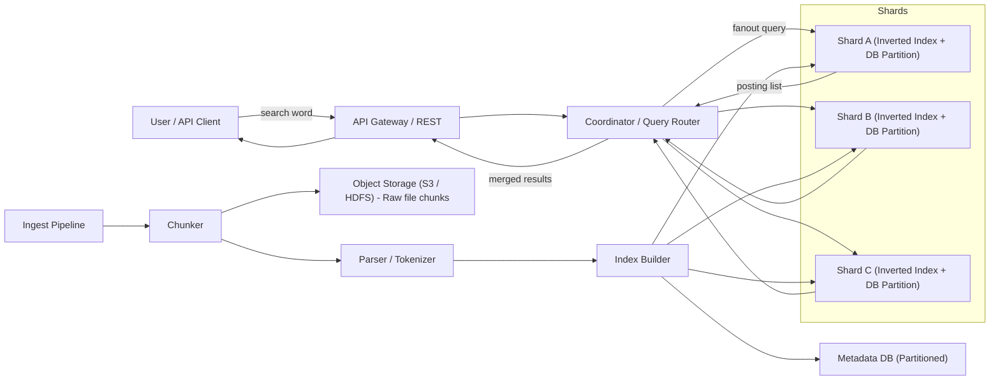

```mermaid
flowchart LR
  Client[User / API Client]
  API[API Gateway / REST]
  Coord[Coordinator / Query Router]

  subgraph Shards
    S1["Shard A (Inverted Index + DB Partition)"]
    S2["Shard B (Inverted Index + DB Partition)"]
    S3["Shard C (Inverted Index + DB Partition)"]
  end

  Storage["Object Storage (S3 / HDFS) - Raw file chunks"]
  Ingest["Ingest Pipeline"]
  Chunker["Chunker"]
  Parser["Parser / Tokenizer"]
  Indexer["Index Builder"]
  MetaDB["Metadata DB (Partitioned)"]

  Client -->|search word| API --> Coord
  Coord -->|fanout query| S1
  Coord --> S2
  Coord --> S3
  S1 -->|posting list| Coord
  S2 --> Coord
  S3 --> Coord
  Coord -->|merged results| API --> Client

  %% indexing flow
  Ingest --> Chunker --> Storage
  Chunker --> Parser --> Indexer
  Indexer --> S1
  Indexer --> S2
  Indexer --> S3
  Indexer --> MetaDB

```